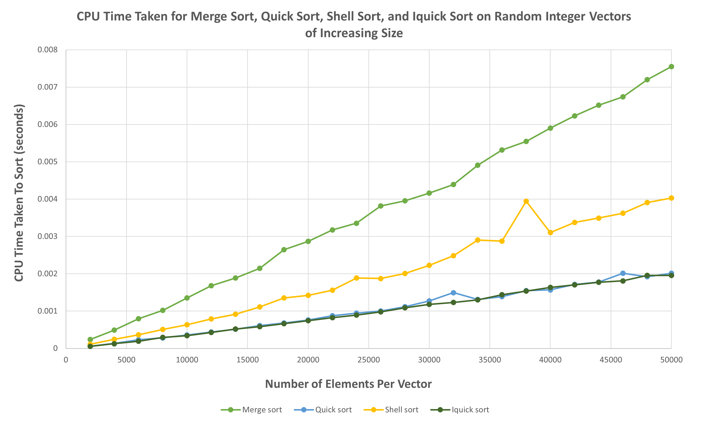

# Sorting Algorithm Testing Program

This C++ project is a simple performance testing system for sorting algorithms. The provided sorting implementations sort vectors of any comparable data type, allowing the implementation of custom or hybrid sorting algorithms to be tested. The program tests the comparison counts and runtimes of sorting algorithms, and compiles the results to a CSV file for easy access. Included in the program are the implementations of various common sorting algorithms, as well as a hybrid sorting algorithm aiming to improve the slower runtime of quick sorting on smaller datasets. 

## Included Sorting Algorithms

- **Bubble Sort:** A simple sorting method that repeatedly steps through the vector, compares adjacent elements, and swaps them if they are in the wrong order. It has a worst-case time complexity of O(n^2), making it very inefficient for large datasets.

- **Insertion Sort:** Builds the final sorted vector one element at a time by iteratively placing each element in its correct position. It has a worst-case time complexity of O(n^2) but performs well on small datasets and nearly sorted lists.

- **Selection Sort:** Finds the minimum element in the unsorted part and places it at the beginning, repeating until the vector is sorted. It has a worst-case time complexity of O(n^2), also making it slow on large datasets.

- **Merge Sort:** A divide-and-conquer algorithm that divides the vector into halves, recursively sorts them and then merges them back together. It guarantees a stable O(n log n) time complexity, making it efficient for large datasets but requires extra space complexity to hold a temporary vector.

- **Quick Sort:** Selects a 'pivot,' partitions the array based on the pivot, and recursively sorts the sub-arrays. It has an average-case time complexity of O(n log n), with a worst-case scenario of O(n^2). It can be slower than some non-recursive sorting methods on smaller or sorted/partially sorted data sets.

- **Shell Sort:** Attempts to optimize insertion sort by sorting pairs of elements far apart and progressively reducing the gap. Its time complexity depends on the chosen gap sequence but is generally between O(n log^2 n) and O(n^2).

- **Iquick Sort (Hybrid):** Is regular quick sort, except when the sub-vectors being sorted are shorter than some predetermined threshold length, insertion sort is used instead of quick sort. This threshold can be changed to fit use.

## How does it work?

The testing program works by using a custom object called `SortStats`. Each inlcuded sroting implmenetion returns a `SortStats` object upon completion which holds data about the procedure, such as the name of the sorting algorithm used, the size of the vector sorted, the number of comparison done, and the CPU time taken for the vector to be sorted, it also holds a string concationation of this data to be ouput into a CSV.

The output within the CSV will be ordered as follows, using bubble sort as an example, sorting 4 vectors of varrying sizes:

  | **Name**    | **N** | **Comparisons** | **CPU Seconds** |
  |-------------|-------|-----------------|-----------------|
  | bubble sort |  2000 | 3998000         | 0.003197        |
  | bubble sort |  4000 | 15996000        | 0.014169        |
  | bubble sort |  6000 | 35994000        | 0.035031        |
  | bubble sort |  8000 | 63992000        | 0.066863        |

The raw CSV file will ouput in the following format, corresponding to the provided table above:
```
Bubble sort, 2000, 3998000, 0.003197
Bubble sort, 4000, 15996000, 0.014169
Bubble sort, 6000, 35994000, 0.035031
Bubble sort, 8000, 63992000, 0.066863
```

These results can be graphed easily if a user chooses to convert to a XLSX file. The following are the results yielded for the various included sorting algorihtms using the exact same randomly generated vectors of increasing sizes for each method:




*Note: Although the sorting tests were conducted on integers, the vectors can be of any comparable data type.

## Installation and Use

Follow these steps to set up and run the ************** in :

1. Clone the repository to your local machine:

   ```bash
   git clone 
   ```

## Contact

Feel free to reach out if you have any questions, suggestions, or feedback:

- **Email:** dpa45@sfu.ca
- **LinkedIn:** [@Daksh Patel](https://www.linkedin.com/in/daksh-patel-956622290/)