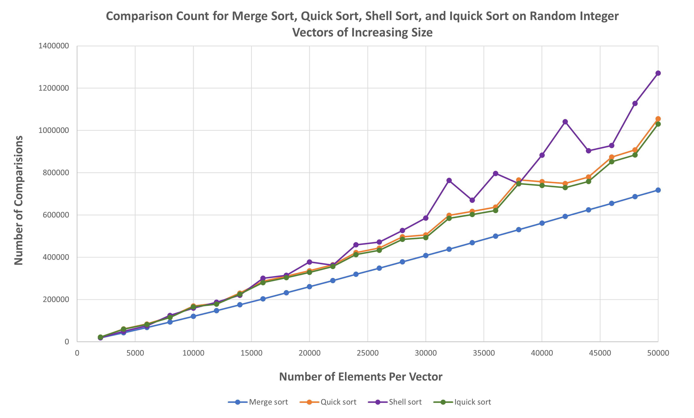

# Sorting Algorithm Testing Program

This C++ project is a simple performance testing system for sorting algorithms. The provided sorting implementations sort vectors of any comparable data type, allowing the implementation of custom or hybrid sorting algorithms to be tested. The program tests the comparison counts and runtimes of sorting algorithms, and compiles the results to a CSV file for easy access. Included in the program are the implementations of various common sorting algorithms, as well as a hybrid sorting algorithm aiming to improve the slower runtime of quick sorting on smaller datasets. 


## Included Sorting Algorithms

- **Bubble Sort:** A simple sorting method that repeatedly steps through the vector, compares adjacent elements, and swaps them if they are in the wrong order. It has a worst-case time complexity of O(n^2), making it very inefficient for large datasets.

- **Insertion Sort:** Builds the final sorted vector one element at a time by iteratively placing each element in its correct position. It has a worst-case time complexity of O(n^2) but performs well on small datasets and nearly sorted lists.

- **Selection Sort:** Finds the minimum element in the unsorted part and places it at the beginning, repeating until the vector is sorted. It has a worst-case time complexity of O(n^2), also making it slow on large datasets.

- **Merge Sort:** A divide-and-conquer algorithm that divides the vector into halves, recursively sorts them and then merges them back together. It guarantees a stable O(n log n) time complexity, making it efficient for large datasets but requires extra space complexity to hold a temporary vector.

- **Quick Sort:** Selects a 'pivot,' partitions the array based on the pivot, and recursively sorts the sub-arrays. It has an average-case time complexity of O(n log n), with a worst-case scenario of O(n^2). It can be slower than some non-recursive sorting methods on smaller or sorted/partially sorted data sets.

- **Shell Sort:** Attempts to optimize insertion sort by sorting pairs of elements far apart and progressively reducing the gap. Its time complexity depends on the chosen gap sequence but is generally between O(n log^2 n) and O(n^2).

- **Iquick Sort (Hybrid):** Is regular quick sort, except when the sub-vectors being sorted are shorter than some predetermined threshold length, insertion sort is used instead of quick sort. This threshold can be changed to fit use.


## How does it work?

The testing program works by using a custom object called `SortStats`. Each inlcuded sroting implmenetion returns a `SortStats` object upon completion which holds data about the procedure, such as the name of the sorting algorithm used, the size of the vector sorted, the number of comparison done, and the CPU time taken for the vector to be sorted, it also holds a string concationation of this data to be ouput into a CSV.

The output within the CSV will be ordered as follows, using bubble sort as an example, sorting 4 vectors of varrying sizes:

  | **Name**    | **N** | **Comparisons** | **CPU Seconds** |
  |-------------|-------|-----------------|-----------------|
  | bubble sort |  2000 | 3998000         | 0.003197        |
  | bubble sort |  4000 | 15996000        | 0.014169        |
  | bubble sort |  6000 | 35994000        | 0.035031        |
  | bubble sort |  8000 | 63992000        | 0.066863        |

The raw CSV file will ouput in the following format, corresponding to the provided table above:
```
Bubble sort, 2000, 3998000, 0.003197
Bubble sort, 4000, 15996000, 0.014169
Bubble sort, 6000, 35994000, 0.035031
Bubble sort, 8000, 63992000, 0.066863
```

These results can be graphed easily if a user chooses to convert to a XLSX file. The following are the results yielded for the various included sorting algorihtms using the exact same randomly generated vectors of increasing sizes for each method:





## Installation and Use

Follow these steps to set up and run the ************** in :

1. Clone the repository to your local machine:

   ```bash
   git clone 
   ```


## Contact

Feel free to reach out if you have any questions, suggestions, or feedback:

- **Email:** dpa45@sfu.ca
- **LinkedIn:** [@Daksh Patel](https://www.linkedin.com/in/daksh-patel-956622290/)


# Sorting

In this assignment, your task is to run performance experiments on 7 sorting
algorithms: *bubble* sort, *insertion* sort, *selection* sort, *merge* sort,
*quick* sort, *shell* sort, and a hybrid algorithm combining quick sort and
insertion sort that we'll call *iquick* sort. You'll create a spreadsheet to
report on your results.


*iquick* sort is regular quick sort, except when the sub-vectors being sorted
are shorter than some predetermined threshold length, insertion sort is used instead
of quick sort. If you choose a good threshold length, you can get better
average-time performance than regular quick sort. Do some experimentation to
find the best threshold length for *iquick* sort!


Notice that most of the functions in [a4_base.h](a4_base.h) are *template*
functions, i.e. they take a `vector<T>` as input, where `T` is a type of value
that can be sorted.

All the sorts return a `SortStats` object containing their running
time and comparisons counts:

```bash
typedef unsigned long ulong;

struct SortStats
{
    string sort_name;
    size_t vector_size = 0;
    ulong num_comparisons = 0;
    double cpu_running_time_sec = 0.0;

    string to_csv() const
    {
        return sort_name + ", " 
             + to_string(vector_size) + ", " 
             + to_string(num_comparisons) + ", " 
             + to_string(cpu_running_time_sec);
    }
}; 
```

For this assignment, `num_comparisons` is the number of times `<` or `<=` is
called on the values in the vector. It's declared to be of type `ulong`
(`unsigned long`) because the comparison counts can get very large.

You should modify basic sorting functions to return accurate `SortStats`
objects. You can write helper functions if you like.


## Generating the Experimental Data

When your sorting algorithms are ready, use them to generate the following data:

- For each of the 7 sorting algorithms, do the following:
  - For *N* = 2000, 4000, 6000, ..., 50000 (25 different values of *N*) do the
    following:
    - create a vector of *N* random integers, where the numbers in the vectors
      range from 1 to *N*
    - run the sort on the vector of random integers
    - print the sort name, amount of data being sorted, number of comparisons
      that were done, and the CPU time (in seconds)

Since there are 7 algorithms and 25 values of *N*, you'll end up with $$7 \cdot
25 = 175$$ results. 

If you print the individual results as comma separated values (CSVs), then you
can more easily import them into a spreadsheet. For example, here are 4 calls to
bubble sort printed as comma separated values:

```
Bubble sort, 2000, 3998000, 0.003197
Bubble sort, 4000, 15996000, 0.014169
Bubble sort, 6000, 35994000, 0.035031
Bubble sort, 8000, 63992000, 0.066863
.
.
.
```

If you save this output in a file, the file should be readable by Excel or
Google Sheets as a CSV file.

## Visualizing the Data in a Spreadsheet

Using Excel or Google Sheets, create a table of all the data you generated. Here
is an example of what the first four rows of the table ought to look like (the
numbers in your table might be different):

  | **Name**    | **N** | **Comparisons** | **CPU Seconds** |
  |-------------|-------|-----------------|-----------------|
  | bubble sort |  2000 | 3998000         | 0.003197        |
  | bubble sort |  4000 | 15996000        | 0.014169        |
  | bubble sort |  6000 | 35994000        | 0.035031        |
  | bubble sort |  8000 | 63992000        | 0.066863        |

Please make the table 4 columns, and label each column with the given name, as
shown.

> **Remember** The table will have 175 rows of data.

In addition to this table, **draw four graphs**, where the x-axis of each graph
is *N* (the size of the vector being sorted), and has the values from the data
you generated: N=2000, 4000, 6000, ..., 50000. The four graphs are:

- **Graph 1**: **CPU time** for *bubble* sort, *insertion* sort, and *selection*
  sort. The the y-axis is the CPU time in seconds.

- **Graph 2**: **CPU time** for *merge* sort, *quick* sort, *shell* sort,
  and *iquick* sort. The y-axis is the CPU time in seconds.

- **Graph 3**: **comparison counts** for *bubble* sort, *insertion* sort,
  and *selection* sort. The y-axis is the number of comparisons. 

- **Graph 4**: **comparison counts** for *merge* sort, *quick* sort, *shell*
  sort, and *iquick* sort. The y-axis is the number of comparisons. 


The marker will compile and run your program on Ubuntu Linux using
[makefile](makefile) like this:

```bash
> make a4_test
g++ -O3 -std=c++17 -Wall -Wextra -Werror -Wfatal-errors -Wno-sign-compare -Wnon-virtual-dtor -g a4_test.cpp -o a4_test

> ./a4_test
... testing output ...

> valgrind ./a4_test
... valgrind output ...
```

The file `a4_test.cpp` is a test program written by the marker that tests the
correctness of your sorting algorithms. It will #include [a4_base.h](a4_base.h)
and [a4_sort_implementations.h](a4_sort_implementations.h).

Note that the `-O3` flag is one of the options: this asks g++ to optimize the
code for speed.


